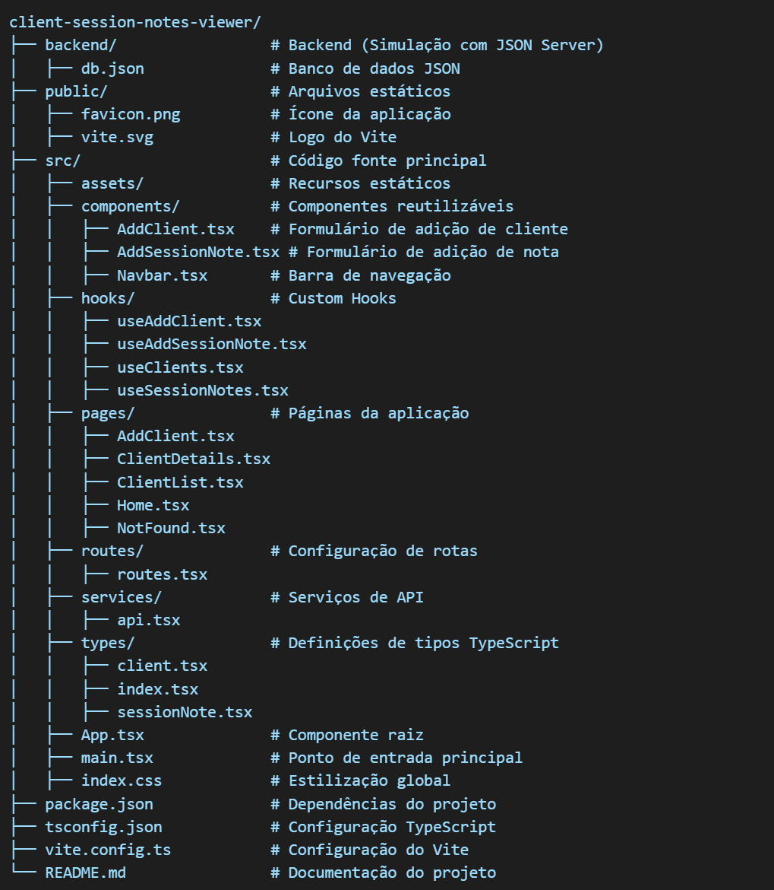

Client Session Notes Viewer

📌 Sobre o Projeto

O Client Session Notes Viewer é uma aplicação web desenvolvida para facilitar a gestão e visualização de notas de sessão de clientes. A plataforma permite adicionar, listar e visualizar notas de sessão associadas a clientes de forma intuitiva e eficiente.

🏗 Arquitetura e Estrutura do Projeto

A estrutura do projeto segue um padrão modular para melhor organização do código:

🚀 Tecnologias Utilizadas

O projeto foi desenvolvido utilizando as seguintes tecnologias:

React com TypeScript para a interface do usuário

Vite para build e otimização

Material UI (MUI) para estilização de componentes

React Router (v7.1.5) para gerenciar a navegação entre páginas

React Query para gerenciamento de estado assíncrono

Axios para requisições HTTP

React Hook Form para gerenciamento de formulários

Styled Components para estilização adicional

📦 Bibliotecas Instaladas

As dependências principais do projeto incluem:

npm install \
  react-router-dom@7.1.5 \
  axios@1.7.9 \
  @tanstack/react-query@5.66.5 \
  react-hook-form@7.54.2 \
  @mui/material@6.4.4 \
  @mui/icons-material \
  styled-components

📂 Backend Simulado

O projeto utiliza um banco de dados simulado com db.json para armazenar os dados de clientes e notas de sessão. Para rodar o backend, utilize:

npx json-server --watch backend/db.json --port 3001

🛠 Como Executar o Projeto

Clone este repositório:

git clone https://github.com/LucasEpifanio/Notas-de-Sessao-de-Clientes.git

Acesse a pasta do projeto:

cd client-session-notes-viewer

Instale as dependências:

npm install

Inicie o backend simulado:

npx json-server --watch backend/db.json --port 3001

Inicie o frontend:

npm run dev

Acesse o projeto no navegador: